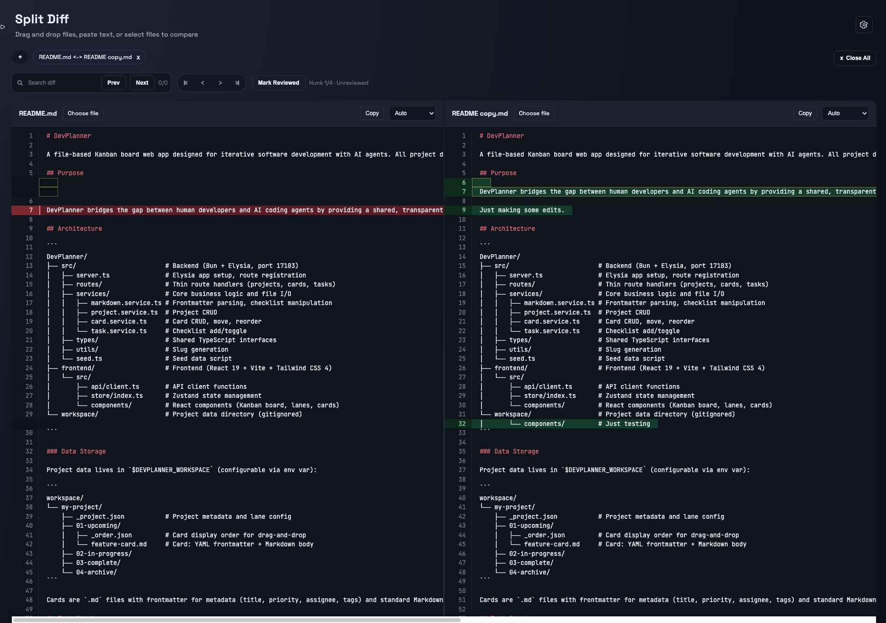

# 🔀 SplitDiff

**A lightning-fast, IDE-quality diff viewer that runs entirely in your browser.**

SplitDiff brings the power of professional IDE diff tools to the web. No installation, no server, no data upload—just drag, drop, and compare. Perfect for code reviews, configuration comparisons, and spot-checking changes anywhere.

---

## ✨ Features

### 🎨 **Beautiful Side-by-Side Diffs**
- **Syntax highlighting** with automatic language detection
- **Line-by-line comparison** with color-coded changes
- **Dark theme** optimized for long viewing sessions

### 🚀 **Blazingly Fast**
- 100% client-side—your files never leave your machine
- No server uploads, no waiting, no privacy concerns
- Instant diff generation, even for large files

### 🎯 **Intuitive Interactions**
- **Drag & drop** files directly into the browser
- **Paste** text content with Ctrl/Cmd+V
- **File picker** for traditional file selection
- **Tabs** with localStorage—your diffs persist across sessions

### 🔍 **Power User Features**
- **Hunk navigation**: Jump between changes with keyboard shortcuts
- **Jump to matching line**: Click any line to find it in the opposite pane
- **Search within diff**: Find text with next/previous navigation
- **Collapse unchanged regions**: Focus on what actually changed
- **Ignore whitespace**: Filter out formatting noise
- **Scroll sync**: Panes stay aligned as you navigate
- **Line wrap toggle**: Handle long lines your way
- **Copy to clipboard**: Extract either file's content with one click

### 📑 **Smart Tab Management**
- Multiple diff comparisons in tabs
- Mark tabs as reviewed/unreviewed
- Quick close-all and tab switching
- Persistent across browser sessions

---

## 🎯 Use Cases

- **Code Reviews**: Compare file versions before committing
- **Configuration Management**: Spot differences between config files
- **Documentation**: Compare README or doc versions
- **Learning**: Understand changes between code iterations
- **Debugging**: Identify what changed between working/broken versions

---

## 🚀 Getting Started

1. Open `index.html` in your browser
2. Drag and drop two files, or paste text content
3. Instantly see your diff with full syntax highlighting

That's it! No build step, no installation, no configuration.

---

## ⚡ Quick Launch with Raycast

For instant access, add SplitDiff as a Raycast Quicklink:

1. Open Raycast and search for **"Create Quicklink"**
2. Configure the quicklink:
   - **Name**: `Split Diff`
   - **Link**: `file:///path/to/SplitDiff/index.html` (Windows) 
        - or `file:///path/to/SplitDiff/index.html` (Mac)
   - **Alias**: `diff` (or your preferred shortcut)
3. Hit Enter to save

Now just open Raycast (⌘+Space or your hotkey), type `diff`, and press Enter to launch SplitDiff instantly!

**Tip**: You can also assign a dedicated keyboard shortcut in Raycast's preferences for one-key access.

---

## 🛠 Technical Highlights

- Pure JavaScript—no frameworks, no dependencies
- Leverages modern browser APIs for optimal performance
- localStorage for tab persistence
- Responsive design that works on any screen size

---

## 📄 License

MIT License—use it anywhere, for anything.

---

**Made with ❤️ for developers who need fast, reliable diffs without the overhead.**
